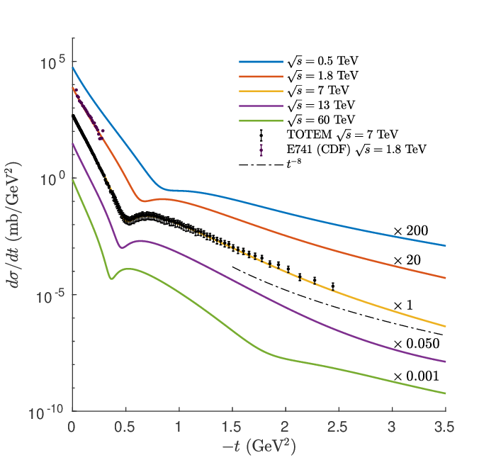

# GRANIITTI
https://arxiv.org/abs/1910.06300

[](https://opensource.org/licenses/MIT)
[](https://www.gnu.org/licenses/gpl-3.0)
[](https://github.com/mieskolainen/graniitti/workflows/graniitti-install-generate-test/badge.svg?branch=master)


## Algorithmic Engine and Monte Carlo Event Generator for High Energy Diffraction



See VERSION.json for the version information


## Physics introduction at
## https://mieskolainen.github.io

</br>


## Fast instructions on Ubuntu 20.x

Compile C++ code
```
sudo apt install cmake g++ python3-dev curl
git clone --depth 1 https://github.com/mieskolainen/graniitti
cd graniitti && cd install && source autoinstall.sh && cd ..
source ./install/setenv.sh 
make -j4
```

Commands and guidance
```
Run ./bin/gr and see /docs/FAQ
```

Simulate MC events
```
./bin/gr -i ./fitcard/STAR_1792394_pipi.json -w true -l true -n 50000
```

Setup virtual Python environment via Conda
```
wget https://repo.anaconda.com/archive/Anaconda3-2022.05-Linux-x86_64.sh
chmod +x and execute the installer

conda create -y --name graniitti python==3.8.5
conda activate graniitti
pip install -r requirements.txt
```

(Python) Analyze MC events and data
```
python python/iceshot --hepmc3 STAR_1792394_pipi --hepdata dataset_STAR_1792394_pipi --pid '[[211,-211]]'
```

(Python) Compare MC with differential fiducial measurements made at RHIC/Tevatron/LHC
```
pytest tests/testbench_exloop.py -s --POMLOOP true
pytest tests/testbench_cepdata.py -s --POMLOOP true
```

(Python) MC model tuning via HPC-distributed Bayesian / evolutionary optimization
```
ray start --head
python python/icetune --tuneset default
```

(Python) Unit and integration tests
```
make -j4 TEST=TRUE && ./bin/testbench*
pytest tests/testbench_*.py -s
```


## Reference

If you use this work in your research, please cite the paper:
```
@article{mieskolainen2019graniitti,
    title={GRANIITTI: A Monte Carlo Event Generator for High Energy Diffraction},
    author={Mikael Mieskolainen},
    year={2019},
    journal={arXiv:1910.06300},
    eprint={1910.06300},
    archivePrefix={arXiv},
    primaryClass={hep-ph}
}
```
