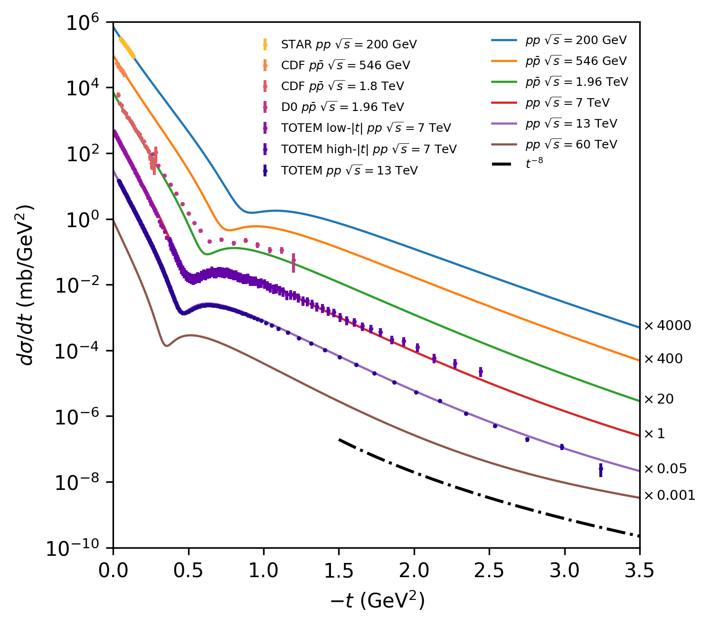
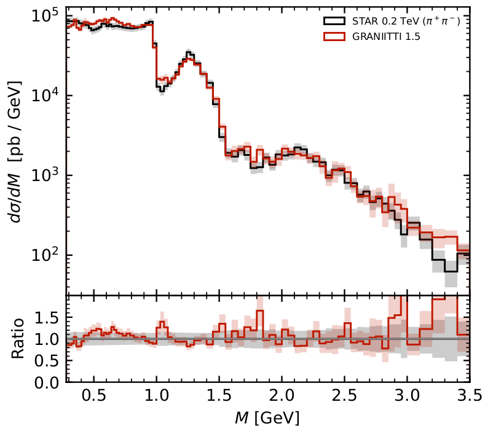

# GRANIITTI

## Monte Carlo Event Generator for High Energy Diffraction

[](https://opensource.org/licenses/MIT)
[](https://www.gnu.org/licenses/gpl-3.0)
[](https://github.com/mieskolainen/graniitti/actions)





#### References

- [arXiv:2304.06010](https://arxiv.org/abs/2304.06010)
- [arXiv:1910.06300](https://arxiv.org/abs/1910.06300)

#### Presentations

- [Diffraction and Low-x 2026](https://indico.cern.ch/event/1632252/contributions/7229503)
- [Diffraction and Low-x 2022](https://indico.cern.ch/event/1148802/contributions/5004853)

<br>

## Update Notes

> See [docs/RELEASE.md](docs/RELEASE.md) and [VERSION.json](VERSION.json) for the latest version info.

<br>

## TUNE status

The current soft model parameters are **work-in-progress**. The main goal is a single *global tune* applicable across energies. Hard processes use the basic SM parameters, LHA-PDFs and literature values.

> Users are encouraged to implement their own parameter inference, and each new soft Pomeron model variant: `GP, MP, XP, TP`, requires its own parameters. GRANIITTI provides HPC-distributed tools for this.

<details>
<summary>More details</summary>
<br>

> **GP status**: parameter inference was done with `icetune` against STAR exclusive pi+pi- and K+K- data at $\sqrt{s}=200, 510$ GeV, and further tunes should include also LHC data at 13 TeV. Photoproduction parameters come mostly from HERA data based fits and eikonal (screening) model from elastic scattering data. Optimal inference, especially in terms of f-meson angular couplings, may require fully differential event-level data (Open Data releases).

> Current `modeldata/TUNE0` for `GP` model was obtained in two steps with icetune. First using global optimization with `HEBO` algorithm and then, with autograd based optimization using `ampfit` approach which operates by constructing interpolated complex amplitude surrogates.

> **MP status**: a placeholder tune.

> **XP status**: a placeholder tune.

> **TP status**: a placeholder tune with parameter values from the original papers.

</details>

<br>

## Physics introduction

See the project page at https://mieskolainen.github.io.

<br>

## Installation

### 1. Pull the repository

```bash
git clone --depth 1 https://github.com/mieskolainen/graniitti.git && cd graniitti
```

### 2. Environment setup

**Recommended**

Install Conda virtual environment for the Python tools:

```bash
wget https://repo.anaconda.com/miniconda/Miniconda3-latest-Linux-x86_64.sh -O Miniconda3.sh
chmod +x Miniconda3.sh && ./Miniconda3.sh
```

After installation, activate Conda and create the environment:

```bash
conda env create -f environment.yml
conda activate graniitti

python -m pip install -r requirements.txt
pip install --no-deps --no-build-isolation hebo
```

<details>
<summary>CERN lxplus</summary>
<br>

We recommend to install `Conda` on `EOS` (e.g. cernbox folder) to get the required python environment, which is needed for the latest plotting and inference tools.

Running only the generator, a pure `CVMFS` environment will suffice:

```bash
source /cvmfs/sft.cern.ch/lcg/views/LCG_110/x86_64-el9-gcc13-opt/setup.sh
```

</details>

### 3. Autoinstall IO-format dependencies

The generator has external dependencies on `HepMC3` and `LHAPDF6`. These IO libraries are installed with:

```bash
conda activate graniitti
source install/setenv.sh
cd install && bash autoinstall.sh && cd ..
```

> Note: The installation path of external dependencies is set under [install/setenv.sh](install/setenv.sh), where the default is `$HOME/local`.

### 4. Compile generator C++ code

Compilation is executed with:

```bash
cmake -S . -B build
cmake --build build -j4
```

The compilation installs program binaries under `bin/`.

<details>
<summary>Build options</summary>

<br>

Additional `CMake` options

```bash
-DMARCH=<target>             (CPU instruction set, default: native)
-DWITH_SYSTEMPATH=ON|OFF     (required on some environments)
-DWITH_ROOT=AUTO|ON|OFF      (ROOT tools)
-DWITH_LIBTORCH=AUTO|ON|OFF  (NEUROJAC normalizing flow integrator)
-DWITH_TEST=ON|OFF           (unit tests)
-DWITH_VALGRIND=ON|OFF       (developer)
```

> On computing clusters with various CPU architectures, use `-DMARCH=x86-64-v3` for relatively modern hardware or `-DMARCH=x86-64-v2` for older.

> Note, if using both `Conda` and `CVMFS`, typically load Conda first and you may need to set `export CONDA_CXX_ABI=1` first, see [install/setenv.sh](install/setenv.sh).

> To install ROOT based aux tools, make sure your ROOT installation exposes `$ROOTSYS` environment variable.

> `NEUROJAC` uses standalone code CPU kernels in normal builds. Configure with `-DWITH_LIBTORCH=AUTO` to use the optional `libtorch` C++ backend when `PyTorch` is installed.

</details>

<br>

## First run

In every new shell session, first set the environment variables, then execute the main generator program:

```bash
conda activate graniitti
source install/setenv.sh
./bin/gr --help
```

> Note `conda activate` first, then the environment setup.

See [docs/FAQ.md](docs/FAQ.md) for more information.

<br>

## Event generation

Simulate MC events:

```bash
./bin/gr -i icepack/SOFTCEP/STAR_1792394/pipi/gencard.json \
-w true -l true -n 100000
```

> **Note**: We generate 100k *weighted* events using `-w true`, with the screening (absorption) loop enabled using `-l true` for accurate differential cross sections.

<br>

## Fiducial Analysis

**Python**: Manual workflows proceed by first generating events, then executing analysis

```bash
python -m core.iceplot --hepmc3 output/STAR_1792394_pipi.hepmc3 --analysis icepack/SOFTCEP/STAR_1792394/pipi
```

**Python**: Fully automated workflows proceed with icepacks

```bash
bash icepack/run.sh icepack/UPC --NEVENTS 10000 --LOOPSCREEN 1 --WEIGHTED 1
```

See [icepack/README.md](icepack/README.md) for more information.

<br>

<details>
<summary>See details</summary>

<br>

> Measurement specific generator, fiducial cut and observable steering is encapsulated under `icepack/`. See the fiducial cut definitions on generator side, both in the steering cards and more complex under `src/MUserCuts.cc` activated in some of the analyses, and then further cuts on python side analysis.

> The reason for cut definitions in multiple locations is typically computational efficiency, such as shared MC samples which are further categorized by the analysis cuts.

</details>

<br>

**C++/ROOT**: For more custom, C++ (ROOT) based fast analysis tools and studies

```bash
ls tests/physics/studies

NEVENTS=100000 WEIGHTED=0 LOOPSCREEN=0 bash tests/physics/studies/tensor2/run.sh
```

<br>

## Simulation based inference [R&D]

MC model parameter inference (tuning) is possible via HPC-distributed optimization using Python tools `icetune`, `icescape` and `iceproxy`.

> Modify `submit/campaigns.yml` for the run setup and `submit/tunecards/graniitti` for the model parameters and tuning choices. 

Because the full parameter space is very high-dimensional, successful inference and optimization typically requires experimentation and iterative runs with a small subset of all parameters, adjusting parameter min/max sampling bounds, choosing appropriate datasets, objective functions etc.

> For more information, see [docs/icetune.md](docs/icetune.md) and [submit/README.md](submit/README.md).

<br>

## Code quality assurance [R&D]

See [tests/README.md](tests/README.md).

<br>

## Reference

If you use this work in your research, please cite:

```tex
@article{mieskolainen2023graniitti,
  title={GRANIITTI: Towards a Deep Learning-enhanced Monte Carlo Event Generator for High-Energy Diffraction},
  author={Mieskolainen, Mikael},
  journal={Acta Phys. Polon. Supp.},
  volume={16},
  pages={6},
  year={2023},
  eprint={2304.06010},
  archivePrefix={arXiv},
  primaryClass={hep-ph}
}

@article{mieskolainen2019graniitti,
    title={GRANIITTI: A Monte Carlo Event Generator for High Energy Diffraction},
    author={Mikael Mieskolainen},
    year={2019},
    journal={arXiv:1910.06300},
    eprint={1910.06300},
    archivePrefix={arXiv},
    primaryClass={hep-ph}
}
```
